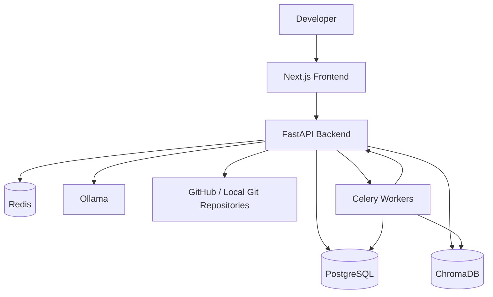
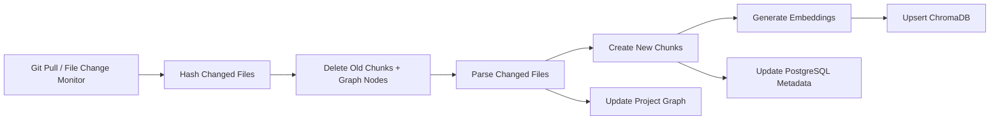
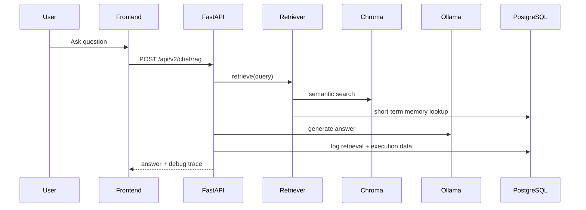

# AI Dev OS Architecture

## High-Level System

## Repository Sync and Incremental Indexing

## RAG Request Flow

## Folder Guide

- `backend/` - FastAPI app, services, and background tasks
- `frontend/` - Next.js app router UI and dashboards
- `docker/` - Container build definitions
- `infrastructure/` - Database bootstrap and deployment assets
- `scripts/` - One-command operational scripts
- `docs/` - API, architecture, and support documentation
